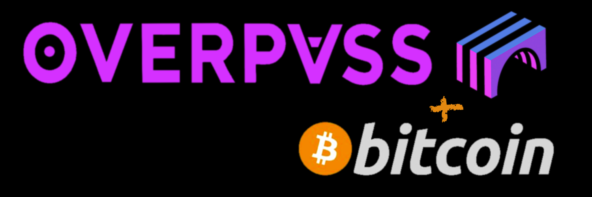

## For more information head over to: [overpass.network](https://overpass.network)

# **🚀 Overpass Protocol: Privacy-Preserving Transactions on Bitcoin ₿**

## **🦄 Overview**

Overpass Protocol is a groundbreaking unilateral channel + ZKP + SMT(Sparse Merkle Tree) network that enables private, secure, and scalable off-chain transactions on the Bitcoin blockchain. By leveraging advanced cryptography, zero-knowledge proofs, and unilateral state channel technology, Overpass provides unprecedented privacy while maintaining the security guarantees of the Bitcoin network.

## **📚 Key Features:**

- **Privacy-Preserving Transactions**: Enhanced transaction privacy using stealth addresses and zero-knowledge proofs
- **Scalable State Channels**: Efficient off-chain scaling solution with instant finality
- **Bitcoin Compatibility**: Seamless integration with the Bitcoin network
- **Secure HTLC Implementation**: Hash Time-Locked Contracts for trustless cross-chain operations
- **Advanced Cryptography**: Implements cutting-edge cryptographic primitives including:
  - Sparse Merkle Trees for efficient state management
  - Zero-knowledge circuits for private state transitions
  - ChaCha20-Poly1305 for secure encryption

## **🏗️ Architecture:**

Overpass consists of three main components:

1. **Core Protocol** (`overpass_core/`):
   - State channel implementation
   - Cryptographic primitives
   - Bitcoin integration
   - Network protocol

2. **WASM Module** (`overpass_wasm/`):
   - WebAssembly bindings
   - Browser-compatible crypto operations
   - Client-side state management

3. **Frontend Interface** (`frontend/`):
   - React-based user interface
   - Real-time transaction monitoring
   - Wallet management
   - Channel operations dashboard

## **🔧 Development Setup:**


### Prerequisites

- Rust 1.75+
- Node.js 18+
- WASM Pack
- Bitcoin Core (for development)

## **🏁 Overpass Demo Project:**

This project demonstrates the core functionality of the Overpass privacy-first state channel network.

## Installation
```bash
# Clone repository
git clone https://github.com/yourusername/overpass.git
cd overpass

# Install dependencies
cargo build
cd frontend && npm install

# Build WASM module
cd overpass_wasm && wasm-pack build

# Start development environment
npm run dev
```
### In a new terminal window:
```
chmod +x setup.sh
./setup.sh
```

## Available Demos

1. **Full Demo**
   ```bash
   npm run demo
   ```
   Demonstrates all Overpass features in sequence.

2. **Wallet Demo**
   ```bash
   npm run demo:wallet
   ```
   Shows wallet creation and management.

3. **Payment Channel Demo**
   ```bash
   npm run demo:payment
   ```
   Demonstrates payment channel operations.

4. **HTLC Demo**
   ```bash
   npm run demo:htlc
   ```
   Shows Hash Time-Locked Contract functionality.

## Getting Started

1. Install dependencies:
   ```bash
   npm install
   ```

2. Run the full demo:
   ```bash
   npm run demo
   ```

## Demo Components

- `wallet-demo.ts`: Wallet creation and management
- `payment-channel-demo.ts`: Payment channel operations
- `htlc-demo.ts`: Hash Time-Locked Contracts
- `run-demo.ts`: Full demo runner

## **🔐 Security Considerations:**

Overpass implements multiple layers of security:

- State verification through zero-knowledge proofs
- Secure multi-party computation for channel operations
- Time-locked fallback mechanisms
- Encrypted state storage
- Quantum-resistant cryptographic primitives

## **🚧 Development Status:**

⚠️ **Warning**: Overpass is currently in active development and not ready for production use. Use at your own risk.

Current development phase: `Alpha`

## Contributing

We welcome contributions! Please see our [Contributing Guidelines](CONTRIBUTING.md) for details on:

- Code style
- Development workflow
- Testing requirements
- Security considerations

## **📖 Documentation:**

- [Technical Specification](docs/SPEC.md)
- [API Reference](docs/API.md)
- [Security Model](docs/SECURITY.md)
- [Architecture Overview](docs/ARCHITECTURE.md)

## **📜 License:**

This project is licensed under the MIT License - see the [LICENSE](LICENSE) file for details.

## **🙏 Acknowledgments:**

- Bitcoin Core Team
- Plonky2 Developers
- The Zero Knowledge Community

## **📧 Contact:**

- **GitHub Issues 💻 :** [Project Issues](https://github.com/yourusername/overpass/issues)
- **Mail 📨 :** info@overpass.network

---

### *Built with ❤️ by the Overpass Team:*
## **🔎 Irrefutable Labs 🔐**